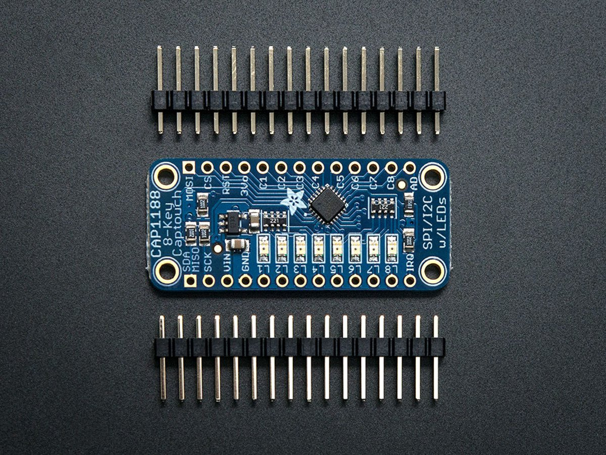
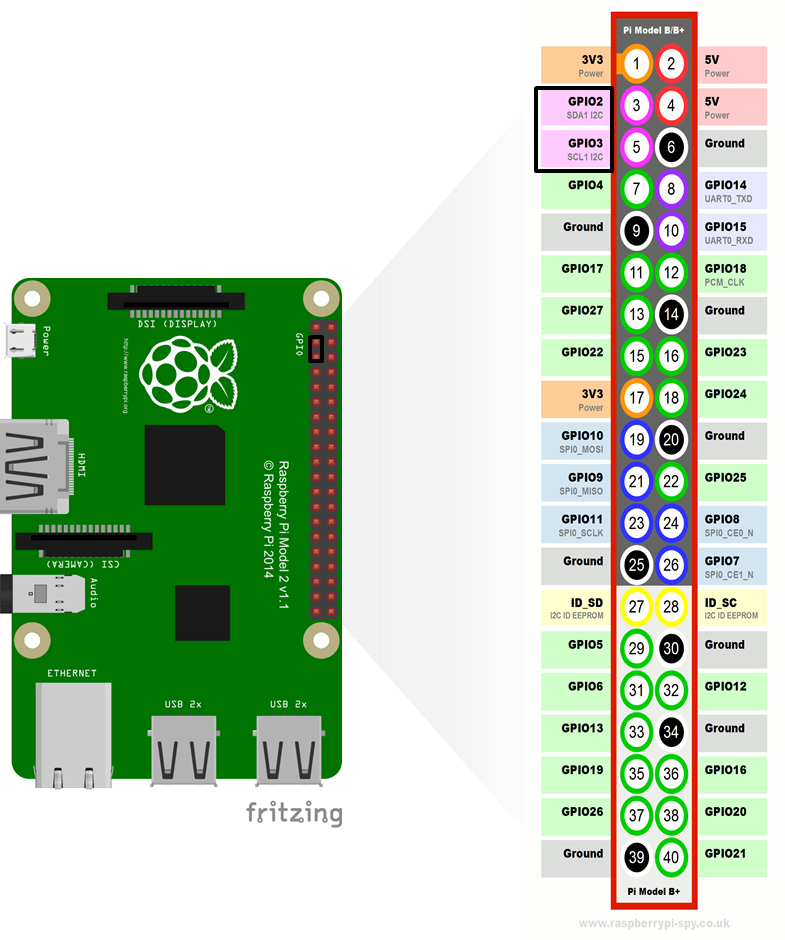
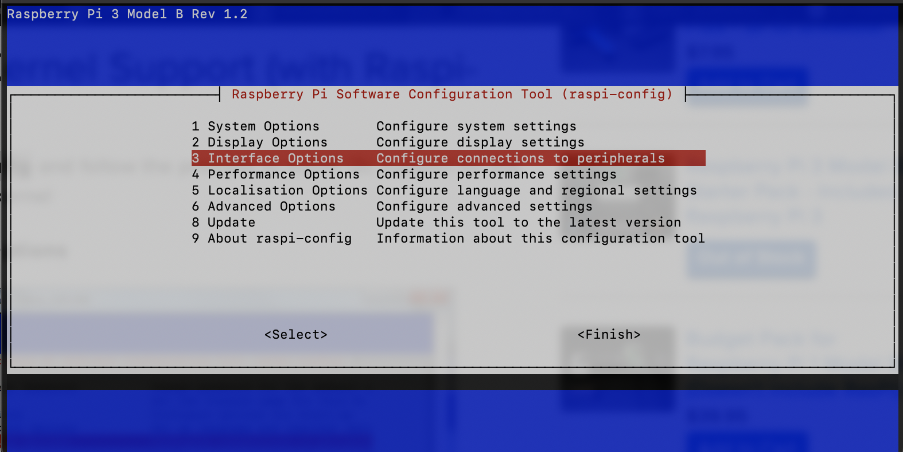
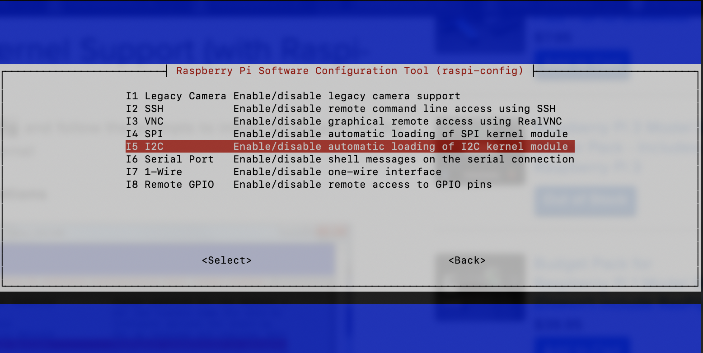
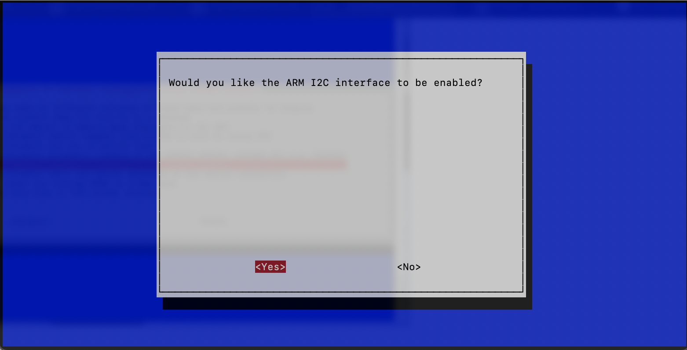
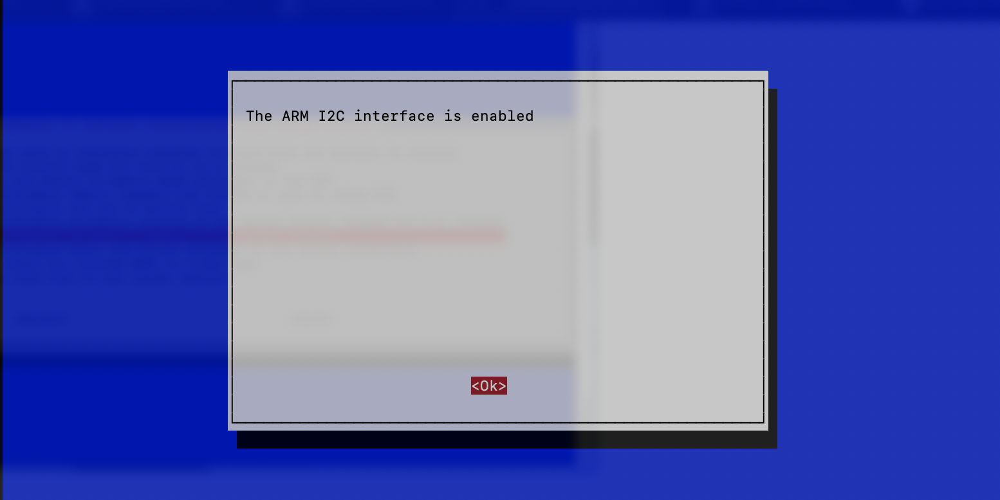

Esto es sólo un controlador de dispositivo de linux básico. Esto explicará cómo pasar los argumentos al controlador de dispositivo de linux.

## `Dispositivo I2C`

El CAP1188 es un controlador táctil capacitivo que ofrece una amplia variedad de funciones de botón y proximidad, y facilita a los diseñadores la incorporación de interfaces táctiles estéticamente agradables, de bajo coste y robustas. <br>

El CAP1188 también contiene 8 controladores de LED que ofrecen encendido/apagado total, parpadeo de velocidad variable, controles de atenuación y respiración. Cada uno de los controladores de LED puede vincularse a una de las entradas del sensor para que se active cuando se detecte un toque. Además, cada controlador LED puede controlarse individualmente a través de un controlador anfitrión.

- 8 entradas de sensor táctil capacitivo
- 8 salidas de controlador LED
- Sensibilidad programable
- Recalibración automática
- Umbrales individuales para cada botón
- Detección de proximidad
- Detección de patrones de botones múltiples
- Filtrado analógico para fuentes de ruido del sistema
- Función de pulsar y mantener para aplicaciones de volumen
- Funcionamiento de bajo consumo
- I²C™ y SMBus

## `Configuracion de driver`

La estructura `file_operations` está definida en `linux/fs.h` y contiene punteros a funciones definidas por el controlador que realizan varias operaciones en el dispositivo. Cada campo de la estructura corresponde a la dirección de alguna función definida por el controlador para manejar una operación solicitada.

```C
//File operation structure 
static struct file_operations fops =
{
  .owner          = THIS_MODULE,
  .read           = etx_read,
  .write          = etx_write,
  .open           = etx_open,
  .release        = etx_release,
};
```
Crea la estructura `i2c_driver` y añádela al subsistema I2C.
```C 
#define SLAVE_DEVICE_NAME   ( "ETX_SENS" ) 

static const struct i2c_device_id etx_cap_id[] = {
        { SLAVE_DEVICE_NAME, 0 },
        { }
};

static struct i2c_driver etx_cap_driver = {
        .driver = {
            .name   = SLAVE_DEVICE_NAME,
            .owner  = THIS_MODULE,
        },
        .probe          = etx_cap_probe,
        .remove         = etx_cap_remove,
        .id_table       = etx_cap_id,
};
```
Se configura la direccion del dispositivo `0x29`.
```C
#define CAP1188_SLAVE_ADDR  (       0x29 )              // CAP1188 Slave Address
/*
** I2C Board Info strucutre
*/
static struct i2c_board_info cap_i2c_board_info = {
        I2C_BOARD_INFO(SLAVE_DEVICE_NAME, CAP1188_SLAVE_ADDR)
};
```
## `Escritura al modulo`
Se crea una funcion para escribir por I2C.
```C
static int I2C_write(unsigned char *buf, unsigned int len)
{
    /*
    ** Sending Start condition, Slave address with R/W bit, 
    ** ACK/NACK and Stop condtions will be handled internally.
    */ 
    int ret = i2c_master_send(etx_i2c_client_cap_sense, buf, len);
    
    return ret;
}
```
Funcion para escribir en el modulo.
Se agrega registro y data a escribir. 
```c
static void CAP1188_write(unsigned char reg, unsigned char data)
{
    unsigned char buf[2] = {0};
    int ret;
    buf[0] = reg;
    buf[1] = data;
    
    ret = I2C_write(buf, 2);
}
```

## `Lectura del modulo`
Se crea una funcion para leer por I2C.
```C
static int I2C_read(unsigned char *out_buf, unsigned int len)
{
    /*
    ** Sending Start condition, Slave address with R/W bit, 
    ** ACK/NACK and Stop condtions will be handled internally.
    */ 
    int ret = i2c_master_recv(etx_i2c_client_cap_sense, out_buf, len);
    
    return ret;
}
```
Funcion para leer el dispositivo se invoca cuando se quiere leer el device file

```C
static ssize_t etx_read(struct file *filp, 
                char __user *buf, size_t count, loff_t *off)
{
    /*
    ** Esta función será llamada cuando leamos el archivo del dispositivo
    */ 
    char str[5];
    uint8_t sensor_data = 0x00;
    uint8_t lectura_reg= 0x03;
    size_t datalen = 0;
    CAP1188_write(0x00,0x01); //sensitivity control
    CAP1188_write(0x00,0x00);
    I2C_write(&lectura_reg, 1);
    I2C_read(&sensor_data, 1);
    sprintf(str, "%d\n", sensor_data);
    datalen = strlen(str);
    if (count > datalen) {
        count = datalen;
    }
    /*
    ** Se copia respuesta en espacio usuario
    */
    if (copy_to_user(buf, str, count)) {
        return -EFAULT;
    }
    pr_info("Driver Read Function Called...!!!\n");
    pr_info("Driver Read Data %d ...!!!\n",sensor_data);
    return count;
}
```

## `Pines de la Raspberry`
Los pines usados son:

- GPIO 2 – SDA
- GPIO 3 – SCL



## `Enable I2C en raspbian con raspberry 3.`
I2C es un estándar muy utilizado diseñado para permitir que un chip hable con otro. Por lo tanto, ya que la Raspberry Pi puede hablar I2C podemos conectarla a una variedad de chips y módulos capaces de I2C.
El bus I2C permite conectar múltiples dispositivos a tu Raspberry Pi, cada uno con una dirección única, que a menudo se puede establecer cambiando la configuración de los puentes en el módulo. Es muy útil ser capaz de ver qué dispositivos están conectados a su Pi como una forma de asegurarse de que todo está funcionando.

    sudo apt-get install -y i2c-tools

Instalando el soporte del Kernel (con Raspi-Config)
Ejecute:
   
    sudo raspi-config 
    
Y siga las indicaciones para instalar el soporte i2c para el núcleo ARM y el kernel de linux

Vaya a Opciones de Interfaz:






Luego de eso reset de la raspberry:

    sudo reboot

Ahora ejecutamos:

    ls /dev/ -l

Se debe visualizar lo siguiente:

    crw-rw----  1 root i2c      89,   1 Nov 19 18:04 i2c-1

Si tienes conectado el sensor debes ejucar el siguiente comando:

    j@raspberrypi:/dev $ sudo i2cdetect -y 1
        0  1  2  3  4  5  6  7  8  9  a  b  c  d  e  f
    00:                         -- -- -- -- -- -- -- -- 
    10: -- -- -- -- -- -- -- -- -- -- -- -- -- -- -- -- 
    20: -- -- -- -- -- -- -- -- -- -- -- 2b -- -- -- -- 
    30: -- -- -- -- -- -- -- -- -- -- -- -- -- -- -- -- 
    40: -- -- -- 43 -- -- -- -- -- -- -- -- -- -- -- -- 
    50: -- -- -- -- -- -- -- -- -- -- -- -- -- -- -- -- 
    60: -- -- -- -- -- -- -- -- -- -- -- -- -- -- -- -- 
    70: -- -- -- -- -- -- -- --  

Visualizar en la raspberry:

    cat /proc/devices | grep "etx_Dev"

Leer el valor de un registro:

    sudo cat /dev/etx_device

Para visualizar los datos del archivo, secciones de codigo:

    objdump -h hello_world.ko

