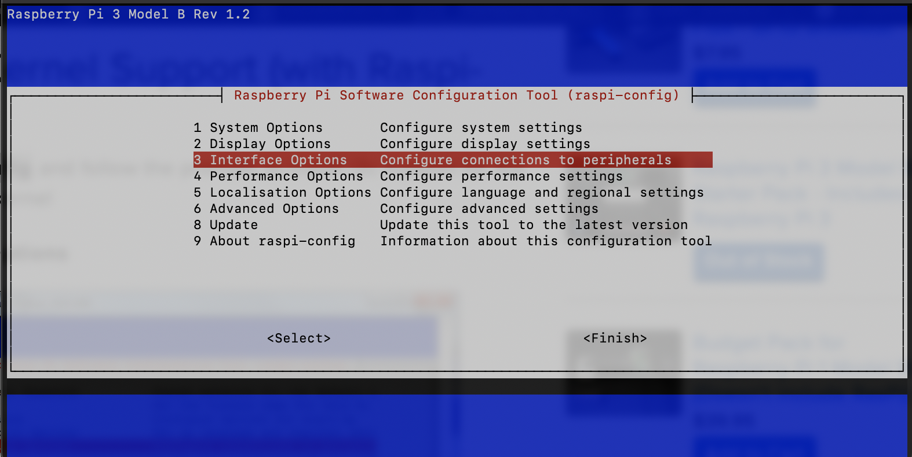
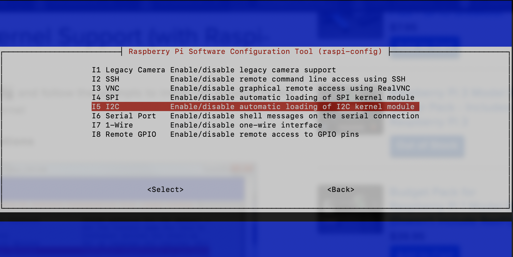
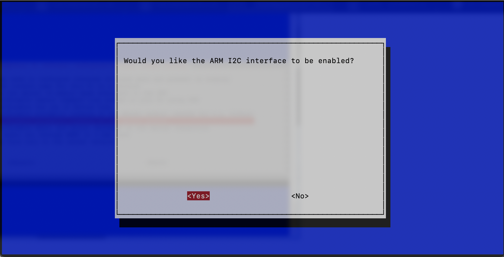
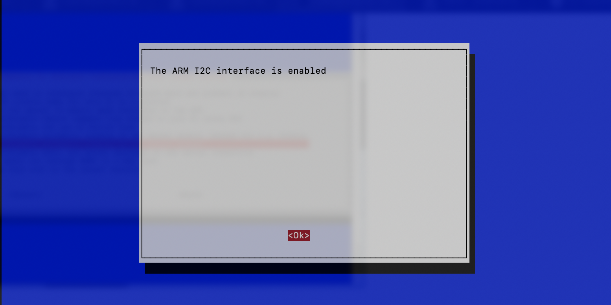

# IMD
Pruebas del kernel en Raspberry
# Instalacion del kernel en la raspberry:
Se debe usar el sigueinte comando por ssh a la raspberry:

    sudo apt install raspberrypi-kernel-headers

Luego de ese comando se debe actualziar el kernel: 

    sudo rpi-update

Para ver el kernel instalado se usa el sigueinte comando:

    j@raspberrypi:~/Documents/IMD/Hello_World $ uname -a
    Linux raspberrypi 5.15.76-v7+ #1597 SMP Fri Nov 4 12:13:17 GMT 2022 armv7l GNU/Linux

## Compilar el proyecto.
Para compilar el proyecto se ingresa a la carpeta y se ejecuta el siguiente comando:

    j@raspberrypi:~/Documents/IMD/Hello_World $ sudo make
    make -C /lib/modules/5.15.76-v7+/build  M=/home/j/Documents/IMD/Hello_World modules
    make[1]: Entering directory '/usr/src/linux-headers-5.15.76-v7+'
    make[1]: Leaving directory '/usr/src/linux-headers-5.15.76-v7+'

## Cargar proyecto
Para cargar se debe usar el comando insmod con privilegio:

    sudo insmod hello_world.ko

Para listar se usa lsmod.

    j@raspberrypi:~/Documents/IMD/Hello_World $ lsmod
    Module                  Size  Used by
    hello_world            16384  0
    rfcomm                 49152  4

Para ver el proyecto ejecutando se usa el comando dmesg:

    j@raspberrypi:~/Documents/IMD/Hello_World $ dmesg
    [    0.000000] Booting Linux on physical CPU 0x0
    [  820.235985] hwmon hwmon1: Voltage normalised
    [ 1036.484686] Jonathan DEBUG: Kernel Module Inserted Successfully...
## Desmontar proyecto
Para desmontar se usa el sigueinte comando:

    sudo rmmod hello_world.ko

## Mostrar info proyecto
Para mostrar informacion del modulo

    j@raspberrypi:~/Documents/IMD/Hello_World $ modinfo hello_world.ko
    filename:       /home/j/Documents/IMD/Hello_World/hello_world.ko
    version:        1:1.0
    description:    hello world driver
    author:         JC<jonathan.cagua@gmail.com>
    license:        GPL
    srcversion:     0A51D4AD6B1C970AA4E05FC
    depends:
    name:           hello_world
    vermagic:       5.15.76-v7+ SMP mod_unload modversions ARMv7 p2v8

## Enable I2C en raspbian con raspberry 3.
I2C es un estándar muy utilizado diseñado para permitir que un chip hable con otro. Por lo tanto, ya que la Raspberry Pi puede hablar I2C podemos conectarla a una variedad de chips y módulos capaces de I2C.
El bus I2C permite conectar múltiples dispositivos a tu Raspberry Pi, cada uno con una dirección única, que a menudo se puede establecer cambiando la configuración de los puentes en el módulo. Es muy útil ser capaz de ver qué dispositivos están conectados a su Pi como una forma de asegurarse de que todo está funcionando.

    sudo apt-get install -y i2c-tools

Instalando el soporte del Kernel (con Raspi-Config)
Ejecute:
   
    sudo raspi-config 
    
Y siga las indicaciones para instalar el soporte i2c para el núcleo ARM y el kernel de linux

Vaya a Opciones de Interfaz:

Luego de eso reset de la raspberry:

    sudo reboot

Ahora ejecutamos:

    ls /dev/ -l

Se debe visualizar lo siguiente:

    crw-rw----  1 root i2c      89,   1 Nov 19 18:04 i2c-1

Si tienes conectado el sensor debes ejucar el siguiente comando:

    j@raspberrypi:/dev $ sudo i2cdetect -y 1
        0  1  2  3  4  5  6  7  8  9  a  b  c  d  e  f
    00:                         -- -- -- -- -- -- -- -- 
    10: -- -- -- -- -- -- -- -- -- -- -- -- -- -- -- -- 
    20: -- -- -- -- -- -- -- -- -- -- -- 2b -- -- -- -- 
    30: -- -- -- -- -- -- -- -- -- -- -- -- -- -- -- -- 
    40: -- -- -- 43 -- -- -- -- -- -- -- -- -- -- -- -- 
    50: -- -- -- -- -- -- -- -- -- -- -- -- -- -- -- -- 
    60: -- -- -- -- -- -- -- -- -- -- -- -- -- -- -- -- 
    70: -- -- -- -- -- -- -- --  
